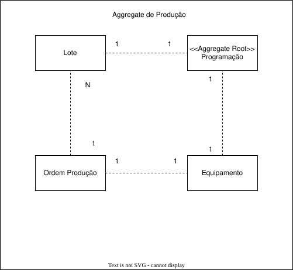
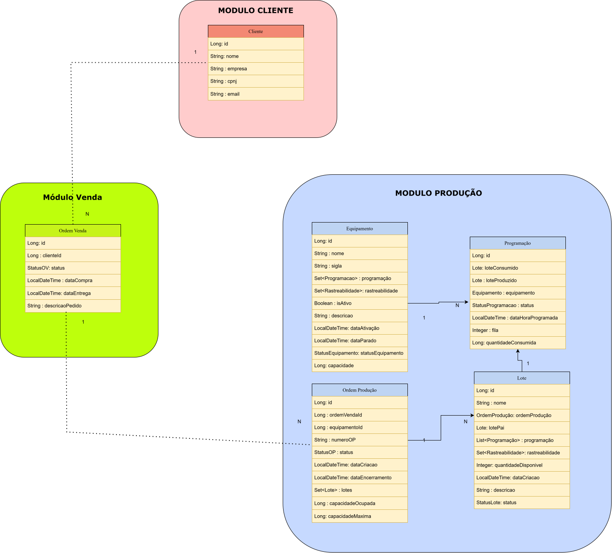

# 🏭 Sistema MES (Manufacturing Execution System) - API

## 📖 Sobre o Projeto
Esta é uma API desenvolvida para o gerenciamento e controle de chão de fábrica. O sistema permite o acompanhamento do ciclo de vida das ordens de produção, desde o abastecimento de insumos até a aprovação final e controle de qualidade, garantindo a rastreabilidade e eficiência industrial.

## 🚀 Tecnologias e Arquitetura
* **Linguagem:** Java
* **Framework:** Spring Boot
* **Arquitetura:** Monolítica Modular
* **Padrões de Projeto:**
    * **Clean Architecture:** Separação entre Domain, Use Cases e Infrastructure.
    * **Use Case Pattern:** Encapsulamento da lógica de negócio.
    * **Strategy Pattern:** Gestão flexível de transição de status.
    * **Factory Pattern:** Criação dinâmica e desacoplada de lotes/ordens.
* **Documentação:** Swagger (OpenAPI 3.1)


## 📐 Arquitetura de Domínio (DDD)

Para garantir a consistência transacional e o desacoplamento do chão de fábrica, o sistema adota os conceitos de **Domain-Driven Design (DDD)**. 

O núcleo do domínio é representado pela **Programação** (*Aggregate Root*), que centraliza e protege as regras de negócio em conjunto com suas entidades filhas e associadas.

### 🧩 Delimitação do Agregado (Aggregate Root: Programação)
* **`Programação` (Raiz):** Controla o ciclo de vida global e o planejamento das execuções no chão de fábrica.
* **`Lote`:** Gerencia os insumos e rastreabilidade previstos para a fabricação.
* **`Ordem Produção`:** Vincula diretamente as ordens de fabricação fabris à programação ativa.
* **`Equipamento`:** Mapeia as máquinas e recursos alocados para atender ao processo.




## 🎯 Casos de Use Principais (Use Cases)

Seguindo o padrão de projeto *Use Case*, a lógica de negócio da aplicação está isolada em classes de serviço de aplicação focadas em uma única responsabilidade. Abaixo estão os principais fluxos implementados:

### 🏭 Módulo de Programação
*   **Criar Programação (`CriarProgramacaoUseCase`):** Valida e registra uma nova programação de fabricação no sistema.
*   **Alterar Estado da Programação (`AlterarProgramacaoUseCase`):** Realiza a mudança de estado da programação (veja a Máquina de Estados abaixo para mais detalhes).
*   **Qualidade do produto (`ColocarRetirarQualidadeUseCase`):** Coloca ou retira o lote de qualidade.
*   **Trocar Sequência (`AlterarSequenciaUseCase`):** Altera Sequencia duas Programações.


### 📋 Módulo de Ordem de Produção
*   **Alterar Atributos da OP (`AlterarAtributosOPUseCase`):** Caso tenha alguma alteração na capacidade de produção ou o equipamento poderá ser alterado por aqui.
*   **Vincular Lote à OP (`VincularLoteUseCase`):** Associa um lote de insumo ou produto à ordem de fabricação correspondente.
*   **Executar a OP(`ExecutarOPUseCase`):** Muda  o Estado da OP para Processando , porém precisa ter Lotes na OP para ser bem sucedida.
*   **Buscar Ordem(`BuscarOrdemProducaoUseCase`):** Busca as OP de forma geral seja ou seleciona por identificação.

### 🏷️ Módulo de Lote
*   **Alterar Atributos (`AlterarAtributosUseCase`):** Altera a descrição do lote (caso mude sua localização ou detalhes dele) e ajuste de quantidade para mais ou menos.
*   **Buscar Lotes (`BuscarLotesUseCase`):** Busca os lotes por Identificação, lotes sem Ordem de Produção, buscar por Ordem de Produção.
*   **Criar Lotes (`CriarLtoeUseCase`):** Cria o lote para colocá-lo em produção


---

## ⚙️ Endpoints da Aplicação

Abaixo estão as rotas principais documentadas no módulo de **Produção**:

### 📦 Programação (programacao-controller)

| Verbo HTTP | Endpoint                                | Descrição                                                           |
| :--- |:----------------------------------------|:--------------------------------------------------------------------|
| `GET` | `api/programacao`                          | Lista todas as programações existentes.                             | não implementada ainda
| `GET` | `api/programacao/{id}`                     | Busca os detalhes de uma programação específica pelo ID.            |não implementada ainda
| `GET` | `api/programacao/{id}/equipamento_programa_all`                    | Busca os equipamentos que ainda não foram produzidos no equipamento |não implementada ainda
| `POST` | `api/programacao/save`                     | Cria uma nova programação no sistema.                               |
| `PUT` | `api/programacao/{id}/{idTroca}/sequencia` | Atualiza a sequência fila da programação.                           |não implementada ainda
| `PATCH` | `api/programacao/{id}/programar`           | Registra a programação de insumos para a programação.             |
| `PATCH` | `/programacao/{id}/executar`            | Altera o status da programação indicando início da produção.        |
| `PATCH` | `/programacao/{id}/concluir`           | Altera o status da programação para concluída                      |
| `PATCH` | `/programacao/{id}/cancelar`             | Cancela a programacao            |
| `DELETE`| `/programacao/{id}/colocar-qualidade`             | Coloca a programação em qualidade e o lote por conseguinte                   |

> **Nota para o Recrutador/Desenvolvedor:**  O fluxo de status de uma programação geralmente segue a ordem: **Criada ➔ Programada ➔ Em Execução ➔ Concluida . Temos Qualidade para programação que não passou na qualidade**.

### 📋 Ordem de Produção (ordem-producao-controller)
O status do lote é gerenciado automaticamente através das operações realizadas no módulo de Lote. Por este motivo, não existem endpoints de atualização direta (PUT/PATCH) para o status na entidade Lote, mantendo a consistência dos dados conforme definido na modelagem.
| Verbo HTTP | Endpoint | Descrição |
| :--- | :--- | :--- |
| `GET` | `/ordem_producao` | Lista todas as ordens de produção ativas. |
| `GET` | `/ordem_producao/{id}` | Busca os detalhes de uma ordem de produção específica. |
| `GET` | `/ordem_producao/{id}/lotes` | Lista os lotes associados a uma ordem de produção. |
| `POST` | `api/ordem_producao/normal` | Cria uma nova ordem de produção. |
| `POST` | `api/ordem_producao/retrabalho` | Cria uma nova ordem de produção para lotes de retrabalho(qualidade). |
| `PATCH` | `api/ordem_producao/vincular/{idOP}/{idLote}` | Vincula um lote dentro da ordem. |
| `PATCH`| `api/ordem_producao/{id}/equipamento/{equipamentoId}` | Vincula o equipamento a OP. |
| `DELETE`| `/ordem_producao/{idProd}` | Exclui uma ordem de produção do sistema. | não implementada ainda
> **Nota para o Recrutador/Desenvolvedor:**  O fluxo de status de uma programação geralmente segue a ordem: **Iniciada ➔ Processando ➔ Finalizada**.
>
### 🏷️ Lote (lote-controller)

O status do lote é gerenciado automaticamente através das operações realizadas no módulo de Programação. Por este motivo, não existem endpoints de atualização direta (PUT/PATCH) para o status na entidade Lote, mantendo a consistência dos dados conforme definido na modelagem.

| Verbo HTTP | Endpoint | Descrição                                                                           |
| :--- | :--- |:------------------------------------------------------------------------------------|
| `GET` | `api/lote` | Lista todos os lotes cadastrados no sistema.                                        |não implementada ainda
| `GET` | `api/lote/{id}` | Busca os detalhes de um lote específico pelo ID.                                    |não implementada ainda
| `GET` | `api/lote/sem-op` | Lista os lotes que ainda não estão vinculados a uma Ordem de Produção (sem OP).     |não implementada ainda
| `POST` | `api/lote/save` | Cria um novo lote no sistema.                                                       |
| `DELETE` | `/lote/{id}` | Remove um lote do sistema.                                                          |não implementada ainda

> **Nota para o Recrutador/Desenvolvedor:**  O fluxo de status de um lote/progrmacao geralmente segue a ordem: **Desabetecido(criada) ➔ Reservado(programada) ➔ Abastecido(em execução) ➔ Consumido(se for totalmente consumido o lote . Programacao = concluida) , Desabastecido( se lote não for totalmente consumido programacao = concluida) . Temos Qualidade para o lote que não passou na qualidade e decisão para o lote ser retrablhado  que quando chega uma programacao ele volta para desabastecido(ainda a implementar)**.
---
### ⚙️ Equipamento (equipamento-controller)

| Verbo HTTP | Endpoint | Descrição |
|:-----------| :--- | :--- |
| `GET`      | `api/equipamento` | Lista todos os equipamentos cadastrados no sistema. |
| `GET`      | `api/equipamento/{id}` | Busca os detalhes de um equipamento específico pelo ID. |
| `POST`     | `api/equipamento/salvar` | Cadastra um novo equipamento no sistema. |
| `DELETE`   | `api/equipamento/{id}/remover` | Remove permanentemente um equipamento do sistema. |
| `PATCH`    | `api/equipamento/{id}/desativar` | Altera o status do equipamento para inativo (exclusão lógica). |
## 🛠️ Como executar o projeto localmente

> ⚠️ **ATENÇÃO AVALIADOR / RECRUTADOR: É OBRIGATÓRIO SUBIR O DOCKER PRIMEIRO!** ⚠️
> Este projeto utiliza o **Keycloak** para gestão de segurança. Se você iniciar o Spring Boot antes de subir o contêiner do Keycloak, a aplicação vai falhar na inicialização.

1. **Clone o repositório:**
   ```bash
   git clone [https://github.com/LucasMathews1995/MES-BackEnd.git](https://github.com/LucasMathews1995/MES-BackEnd.git)

**UML do Projeto**


